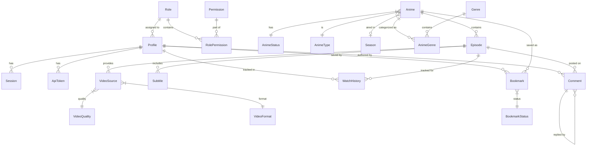

# Zenith Database Documentation

This document provides a comprehensive overview of the **Zenith** database architecture, schema definitions, and seeding strategy.

## 1. Entity Relationship Diagram (ERD)

The following diagram visualizes the relationships between core entities in the Zenith ecosystem.



---

## 2. Schema Reference

The database is managed via Prisma and hosted on PostgreSQL. Below are the detailed model definitions grouped by functional area.

### 2.1 Auth & Access Control

#### `Role`
Defines user levels (e.g., Superadmin, User).
- `id` (String, PK): Unique identifier (e.g., 'superadmin').
- `name` (String): Display name.
- `description` (String, Optional): Role purpose.

#### `Permission`
Granular access tokens for system actions.
- `id` (String, PK): Permission key (e.g., 'settings:update').
- `name` (String): Human-readable name.
- `description` (String, Optional): What this permission allows.

#### `RolePermission`
Join table linking Roles to Permissions (Many-to-Many).
- `roleId` (String, PK, FK): Reference to Role.
- `permissionId` (String, PK, FK): Reference to Permission.

#### `Profile`
User accounts and profile information.
- `id` (String, PK): Unique user ID.
- `username` (String, Unique): Login name.
- `displayName` (String, Optional): User's preferred name.
- `avatarUrl` (String, Optional): URL to profile picture.
- `roleId` (String, FK, Default: 'user'): User's role.
- `passwordHash` (String, Optional): Argon2 hashed password.
- `createdAt` (DateTime): Timestamp of creation.
- `updatedAt` (DateTime): Last update timestamp.

#### `Session`
Active browser sessions for authentication.
- `id` (String, PK): Session token.
- `userId` (String, FK): Reference to Profile.
- `userAgent` (String, Optional): Browser/Device info.
- `lastUsed` (DateTime): Last activity timestamp.

#### `ApiToken`
Programmable access keys for API usage.
- `id` (String, PK): Token key.
- `userId` (String, FK): Reference to Profile.
- `name` (String): Token label.
- `lastUsed` (DateTime): Last usage timestamp.

---

### 2.2 Anime Metadata

#### `Anime`
The core metadata for a series or movie.
- `id` (String, PK): Unique ID.
- `slug` (String, Unique): URL-friendly name.
- `title` (String): Full title.
- `synopsis` (String, Optional): Plot summary.
- `statusId` (String, FK): Aired status (Ongoing, etc.).
- `typeId` (String, FK): Format (TV, Movie, etc.).
- `rating` (String, Optional): Age rating.
- `score` (Float, Default: 0): User/System rating.
- `year` (Int, Optional): Release year.
- `seasonId` (String, FK, Optional): Release season (Winter, etc.).
- `posterKey` (String, Optional): R2 key for portrait image.
- `bannerKey` (String, Optional): R2 key for landscape image.
- `totalEpisodes` (Int, Optional): Planned episode count.

#### `Genre`
Taxonomy for anime classification.
- `id` (Int, PK, Autoincrement): Internal ID.
- `name` (String, Unique): Display name.
- `slug` (String, Unique): URL-friendly slug.

#### `AnimeGenre`
Join table linking Anime to Genres (Many-to-Many).

#### `AnimeStatus` / `AnimeType` / `Season`
Dynamic enum tables for consistent metadata labels and UI colors.

---

### 2.3 Content & Streaming

#### `Episode`
Individual video content units.
- `id` (String, PK): Unique ID.
- `animeId` (String, FK): Parent anime.
- `episodeNumber` (Float): Sequential number (supports .5 specials).
- `title` (String, Optional): Episode name.
- `durationSeconds` (Int, Optional): Length in seconds.
- `thumbnailKey` (String, Optional): R2 key for thumbnail.
- `viewCount` (Int, Default: 0): Total plays.

#### `VideoSource`
Links to actual video files in R2 storage.
- `id` (String, PK): Unique ID.
- `episodeId` (String, FK): Reference to Episode.
- `qualityId` (String, FK): Resolution (1080p, etc.).
- `formatId` (String, FK): Container (hls, mp4, etc.).
- `r2Key` (String): Storage key.
- `url` (String, Optional): Full direct URL (if not using signed keys).
- `isPrimary` (Boolean): Default source for the player.

#### `Subtitle`
Multilingual support for video playback.
- `id` (String, PK): Unique ID.
- `episodeId` (String, FK): Reference to Episode.
- `language` (String): Language code (e.g., 'en', 'id').
- `label` (String): Display label (e.g., 'English').
- `r2Key` (String): Storage key for .vtt/.srt file.

---

### 2.4 User Interaction

#### `WatchHistory`
Tracks user progress through episodes.
- `userId` / `episodeId` (Composite PK): Links User to Episode.
- `progress` (Int, Default: 0): Last watched timestamp in seconds.
- `completed` (Boolean, Default: false): Marked as fully watched.

#### `Bookmark`
User's personal watchlists.
- `userId` / `animeId` (Composite PK): Links User to Anime.
- `statusId` (String, FK): Watchlist state (Watching, Plan, etc.).

#### `Comment`
User interaction on episodes.
- `id` (String, PK): Unique ID.
- `episodeId` / `userId` (FKs): Context of the comment.
- `parentId` (String, FK, Optional): For nested replies.
- `body` (String): Text content.
- `isSpoiler` (Boolean): Blurred by default.
- `isDeleted` (Boolean): Soft delete flag.

---

### 2.5 System

#### `SiteSetting`
Global configuration key-value pairs.
- `key` (String, PK): Setting name (e.g., 'site_name').
- `value` (String): Config value.

---

## 3. Seed Database Information

The `prisma/seed.ts` script performs a full reset and populates the database with essential enums, access controls, and demonstration content.

### 3.1 Initial Setup Data

#### **Permissions**
| ID | Name | Description |
|---|---|---|
| `settings:view` | View Settings | Can view general settings |
| `settings:update` | Update Settings | Can update system settings |
| `users:view` | View Users | Can view member list |
| `users:manage` | Manage Users | Can invite and change user roles |
| `roles:manage` | Manage Roles | Can manage role permissions |
| `anime:create` | Create Anime | Can add new anime |
| `anime:edit` | Edit Anime | Can edit existing anime |
| `anime:delete` | Delete Anime | Can delete anime |
| `episode:manage` | Manage Episodes | Can add/edit/delete episodes |
| `stats:view` | View Statistics | Can view studio dashboard stats |

#### **Roles & Defaults**
- **superadmin**: Full access (granted all permissions).
- **admin**: Access to settings, users, content management, and stats.
- **editor**: Access to content management and stats.
- **user**: Default role for regular members.

#### **Metadata Enums**
- **Statuses**: `ongoing`, `completed`, `upcoming`, `hiatus`.
- **Types**: `TV`, `Movie`, `OVA`, `ONA`, `Special`.
- **Seasons**: `winter`, `spring`, `summer`, `fall`.
- **Video**: Qualities (`360p` to `1080p`), Formats (`hls`, `mp4`, `dash`).
- **Bookmarks**: `watching`, `completed`, `plan`, `dropped`.

### 3.2 Demo Content

#### **Superadmin Account**
- **Username**: `admin`
- **Password**: `password123`
- **Role**: Super Administrator

#### **Sample Animes**
- **Completed**: *Solo Leveling*, *Frieren: Beyond Journey's End*, *Jujutsu Kaisen Season 2*.
- **Ongoing**: *One Piece*, *Ninja Kamui*.
- **Upcoming**: *Chainsaw Man - The Movie: Reze Arc*.

#### **Genres**
Action, Adventure, Comedy, Drama, Fantasy, Isekai, Romance, Sci-Fi, Shounen, Slice of Life.

#### **Site Settings**
- `site_name`: ZenithStream
- `site_description`: Premium Anime Streaming Platform
- `theme_color`: #3b82f6

---

## 4. Usage Commands

```bash
# Generate Prisma client
npx prisma generate

# Push schema changes (Careful: destructive in dev if not using migrations)
npx prisma db push

# Seed the database
npx prisma db seed
```
