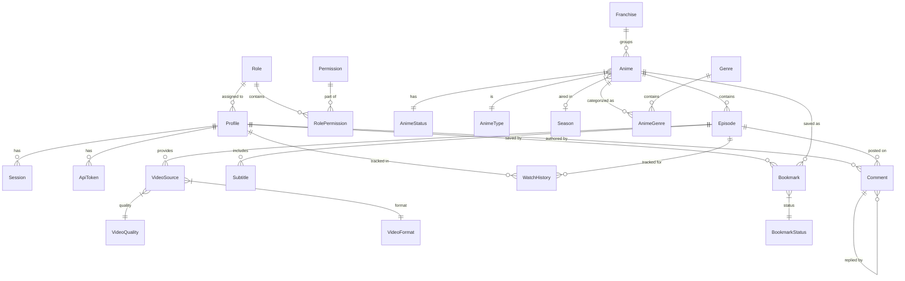

# GoxStream Database Documentation

This document provides a comprehensive overview of the **GoxStream** database architecture, schema definitions, and seeding strategy.

## 1. Entity Relationship Diagram (ERD)

The following diagram visualizes the relationships between core entities in the GoxStream ecosystem.



---

## 2. Schema Reference

The database is managed via Drizzle ORM and hosted on Cloudflare D1 (SQLite). Below are the detailed model definitions grouped by functional area.

### 2.1 Auth & Access Control

#### `Role`
Defines user levels (e.g., Superadmin, User).
- `id` (String, PK): Unique identifier (e.g., 'superadmin').
- `name` (String): Display name.
- `description` (String, Optional): Role purpose.

```sql
CREATE TABLE roles (
  id TEXT PRIMARY KEY,
  name TEXT NOT NULL,
  description TEXT
);
```

#### `Permission`
Granular access tokens for system actions.
- `id` (String, PK): Permission key (e.g., 'settings:update').
- `name` (String): Human-readable name.
- `description` (String, Optional): What this permission allows.

```sql
CREATE TABLE permissions (
  id TEXT PRIMARY KEY,
  name TEXT NOT NULL,
  description TEXT
);
```

#### `RolePermission`
Join table linking Roles to Permissions (Many-to-Many).
- `roleId` (String, PK, FK): Reference to Role.
- `permissionId` (String, PK, FK): Reference to Permission.

```sql
CREATE TABLE role_permissions (
  role_id TEXT NOT NULL REFERENCES roles(id) ON DELETE CASCADE,
  permission_id TEXT NOT NULL REFERENCES permissions(id) ON DELETE CASCADE,
  PRIMARY KEY (role_id, permission_id)
);
```

#### `Profile`
User accounts and profile information.
- `id` (String, PK): Unique user ID.
- `username` (String, Unique): Login name.
- `displayName` (String, Optional): User's preferred name.
- `avatarUrl` (String, Optional): URL to profile picture.
- `roleId` (String, FK, Default: 'user'): User's role.
- `passwordHash` (String, Optional): Argon2 hashed password.
- `createdAt` (DateTime): Timestamp of creation.
- `updatedAt` (DateTime): Last update timestamp.

```sql
CREATE TABLE profiles (
  id TEXT PRIMARY KEY,
  username TEXT UNIQUE NOT NULL,
  display_name TEXT,
  avatar_url TEXT,
  role_id TEXT NOT NULL DEFAULT 'user' REFERENCES roles(id) ON DELETE RESTRICT,
  password_hash TEXT,
  created_at TIMESTAMP NOT NULL DEFAULT CURRENT_TIMESTAMP,
  updated_at TIMESTAMP NOT NULL DEFAULT CURRENT_TIMESTAMP
);
```

#### `Session`
Active browser sessions for authentication.
- `id` (String, PK): Session token.
- `userId` (String, FK): Reference to Profile.
- `userAgent` (String, Optional): Browser/Device info.
- `lastUsed` (DateTime): Last activity timestamp.

```sql
CREATE TABLE sessions (
  id TEXT PRIMARY KEY,
  user_id TEXT NOT NULL REFERENCES profiles(id) ON DELETE CASCADE,
  user_agent TEXT,
  created_at TIMESTAMP NOT NULL DEFAULT CURRENT_TIMESTAMP,
  last_used TIMESTAMP NOT NULL DEFAULT CURRENT_TIMESTAMP
);
```

#### `ApiToken`
Programmable access keys for API usage.
- `id` (String, PK): Token key.
- `userId` (String, FK): Reference to Profile.
- `name` (String): Token label.
- `lastUsed` (DateTime): Last usage timestamp.

```sql
CREATE TABLE api_tokens (
  id TEXT PRIMARY KEY,
  user_id TEXT NOT NULL REFERENCES profiles(id) ON DELETE CASCADE,
  name TEXT NOT NULL,
  created_at TIMESTAMP NOT NULL DEFAULT CURRENT_TIMESTAMP,
  last_used TIMESTAMP NOT NULL DEFAULT CURRENT_TIMESTAMP
);
```

---

### 2.2 Anime Metadata

#### `Franchise`
Groups related anime series (e.g., seasons, movies) together.
- `id` (String, PK): Unique ID.
- `name` (String, Unique): Franchise name (e.g., 'Solo Leveling').
- `slug` (String, Unique): URL-friendly slug.

```sql
CREATE TABLE franchises (
  id TEXT PRIMARY KEY,
  name TEXT UNIQUE NOT NULL,
  slug TEXT UNIQUE NOT NULL,
  created_at TIMESTAMP NOT NULL DEFAULT CURRENT_TIMESTAMP,
  updated_at TIMESTAMP NOT NULL DEFAULT CURRENT_TIMESTAMP
);
```

#### `Anime`
The core metadata for a series or movie.
- `id` (String, PK): Unique ID.
- `slug` (String, Unique): URL-friendly name.
- `title` (String): Full title.
- `synopsis` (String, Optional): Plot summary.
- `statusId` (String, FK): Aired status (Ongoing, etc.).
- `typeId` (String, FK): Format (TV, Movie, etc.).
- `rating` (String, Optional): Age rating.
- `score` (Float, Default: 0): User/System rating.
- `year` (Int, Optional): Release year.
- `seasonId` (String, FK, Optional): Release season (Winter, etc.).
- `franchiseId` (String, FK, Optional): The franchise this anime belongs to.
- `franchiseOrder` (Int, Optional): Sequence order within the franchise.
- `posterKey` (String, Optional): Storage key for portrait image.
- `bannerKey` (String, Optional): Storage key for landscape image.
- `totalEpisodes` (Int, Optional): Planned episode count.

```sql
CREATE TABLE anime (
  id TEXT PRIMARY KEY,
  slug TEXT UNIQUE NOT NULL,
  title TEXT NOT NULL,
  synopsis TEXT,
  status_id TEXT NOT NULL REFERENCES anime_statuses(id) ON DELETE RESTRICT,
  type_id TEXT NOT NULL REFERENCES anime_types(id) ON DELETE RESTRICT,
  rating TEXT,
  score DOUBLE PRECISION DEFAULT 0,
  year INTEGER,
  season_id TEXT REFERENCES seasons(id) ON DELETE SET NULL,
  franchise_id TEXT REFERENCES franchises(id) ON DELETE SET NULL,
  franchise_order INTEGER,
  poster_key TEXT,
  banner_key TEXT,
  total_episodes INTEGER,
  created_at TIMESTAMP NOT NULL DEFAULT CURRENT_TIMESTAMP,
  updated_at TIMESTAMP NOT NULL DEFAULT CURRENT_TIMESTAMP
);
```

#### `Genre`
Taxonomy for anime classification.
- `id` (Int, PK, Autoincrement): Internal ID.
- `name` (String, Unique): Display name.
- `slug` (String, Unique): URL-friendly slug.

```sql
CREATE TABLE genres (
  id SERIAL PRIMARY KEY,
  name TEXT UNIQUE NOT NULL,
  slug TEXT UNIQUE NOT NULL
);
```

#### `AnimeGenre`
Join table linking Anime to Genres (Many-to-Many).

```sql
CREATE TABLE anime_genres (
  anime_id TEXT NOT NULL REFERENCES anime(id) ON DELETE CASCADE,
  genre_id INTEGER NOT NULL REFERENCES genres(id) ON DELETE CASCADE,
  PRIMARY KEY (anime_id, genre_id)
);
```

#### `AnimeStatus` / `AnimeType` / `Season`
Dynamic enum tables for consistent metadata labels and UI colors.

```sql
CREATE TABLE anime_statuses (
  id TEXT PRIMARY KEY,
  name TEXT NOT NULL,
  color TEXT
);

CREATE TABLE anime_types (
  id TEXT PRIMARY KEY,
  name TEXT NOT NULL
);

CREATE TABLE seasons (
  id TEXT PRIMARY KEY,
  name TEXT NOT NULL
);
```

---

### 2.3 Content & Streaming

#### `Episode`
Individual video content units.
- `id` (String, PK): Unique ID.
- `animeId` (String, FK): Parent anime.
- `episodeNumber` (Float): Sequential number (supports .5 specials).
- `title` (String, Optional): Episode name.
- `durationSeconds` (Int, Optional): Length in seconds.
- `thumbnailKey` (String, Optional): Storage key for thumbnail.
- `viewCount` (Int, Default: 0): Total plays.

```sql
CREATE TABLE episodes (
  id TEXT PRIMARY KEY,
  anime_id TEXT NOT NULL REFERENCES anime(id) ON DELETE CASCADE,
  episode_number DOUBLE PRECISION NOT NULL,
  title TEXT,
  synopsis TEXT,
  duration_seconds INTEGER,
  thumbnail_key TEXT,
  aired_at TIMESTAMP,
  view_count INTEGER NOT NULL DEFAULT 0,
  created_at TIMESTAMP NOT NULL DEFAULT CURRENT_TIMESTAMP,
  UNIQUE (anime_id, episode_number)
);
```

#### `VideoSource`
Links to actual video files in R2 storage.
- `id` (String, PK): Unique ID.
- `episodeId` (String, FK): Reference to Episode.
- `qualityId` (String, FK): Resolution (1080p, etc.).
- `formatId` (String, FK): Container (hls, mp4, etc.).
- `fileKey` (String): Storage key.
- `url` (String, Optional): Full direct URL (if not using signed keys).
- `isPrimary` (Boolean): Default source for the player.

```sql
CREATE TABLE video_qualities (
  id TEXT PRIMARY KEY,
  name TEXT NOT NULL
);

CREATE TABLE video_formats (
  id TEXT PRIMARY KEY,
  name TEXT NOT NULL
);

CREATE TABLE video_sources (
  id TEXT PRIMARY KEY,
  episode_id TEXT NOT NULL REFERENCES episodes(id) ON DELETE CASCADE,
  quality_id TEXT NOT NULL REFERENCES video_qualities(id) ON DELETE RESTRICT,
  format_id TEXT NOT NULL REFERENCES video_formats(id) ON DELETE RESTRICT,
  file_key TEXT NOT NULL,
  url TEXT,
  file_size INTEGER,
  is_primary BOOLEAN NOT NULL DEFAULT false,
  created_at TIMESTAMP NOT NULL DEFAULT CURRENT_TIMESTAMP
);
```

#### `Subtitle`
Multilingual support for video playback.
- `id` (String, PK): Unique ID.
- `episodeId` (String, FK): Reference to Episode.
- `language` (String): Language code (e.g., 'en', 'id').
- `label` (String): Display label (e.g., 'English').
- `fileKey` (String): Storage key for .vtt/.srt file.

```sql
CREATE TABLE subtitles (
  id TEXT PRIMARY KEY,
  episode_id TEXT NOT NULL REFERENCES episodes(id) ON DELETE CASCADE,
  language TEXT NOT NULL,
  label TEXT NOT NULL,
  file_key TEXT NOT NULL,
  created_at TIMESTAMP NOT NULL DEFAULT CURRENT_TIMESTAMP
);
```

---

### 2.4 User Interaction

#### `WatchHistory`
Tracks user progress through episodes.
- `userId` / `episodeId` (Composite PK): Links User to Episode.
- `progress` (Int, Default: 0): Last watched timestamp in seconds.
- `completed` (Boolean, Default: false): Marked as fully watched.

```sql
CREATE TABLE watch_history (
  user_id TEXT NOT NULL REFERENCES profiles(id) ON DELETE CASCADE,
  episode_id TEXT NOT NULL REFERENCES episodes(id) ON DELETE CASCADE,
  progress INTEGER NOT NULL DEFAULT 0,
  completed BOOLEAN NOT NULL DEFAULT false,
  updated_at TIMESTAMP NOT NULL DEFAULT CURRENT_TIMESTAMP,
  PRIMARY KEY (user_id, episode_id)
);
```

#### `Bookmark`
User's personal watchlists.
- `userId` / `animeId` (Composite PK): Links User to Anime.
- `statusId` (String, FK): Watchlist state (Watching, Plan, etc.).

```sql
CREATE TABLE bookmark_statuses (
  id TEXT PRIMARY KEY,
  name TEXT NOT NULL,
  color TEXT
);

CREATE TABLE bookmarks (
  user_id TEXT NOT NULL REFERENCES profiles(id) ON DELETE CASCADE,
  anime_id TEXT NOT NULL REFERENCES anime(id) ON DELETE CASCADE,
  status_id TEXT NOT NULL DEFAULT 'plan' REFERENCES bookmark_statuses(id) ON DELETE RESTRICT,
  added_at TIMESTAMP NOT NULL DEFAULT CURRENT_TIMESTAMP,
  PRIMARY KEY (user_id, anime_id)
);
```

#### `Comment`
User interaction on episodes.
- `id` (String, PK): Unique ID.
- `episodeId` / `userId` (FKs): Context of the comment.
- `parentId` (String, FK, Optional): For nested replies.
- `body` (String): Text content.
- `isSpoiler` (Boolean): Blurred by default.
- `isDeleted` (Boolean): Soft delete flag.

```sql
CREATE TABLE comments (
  id TEXT PRIMARY KEY,
  episode_id TEXT NOT NULL REFERENCES episodes(id) ON DELETE CASCADE,
  user_id TEXT NOT NULL REFERENCES profiles(id) ON DELETE CASCADE,
  parent_id TEXT REFERENCES comments(id) ON DELETE CASCADE,
  body TEXT NOT NULL,
  is_spoiler BOOLEAN NOT NULL DEFAULT false,
  is_deleted BOOLEAN NOT NULL DEFAULT false,
  created_at TIMESTAMP NOT NULL DEFAULT CURRENT_TIMESTAMP,
  updated_at TIMESTAMP NOT NULL DEFAULT CURRENT_TIMESTAMP
);
```

---

### 2.5 System

#### `SiteSetting`
Global configuration key-value pairs.
- `key` (String, PK): Setting name (e.g., 'site_name').
- `value` (String): Config value.

```sql
CREATE TABLE site_settings (
  key TEXT PRIMARY KEY,
  value TEXT NOT NULL,
  updated_at TIMESTAMP NOT NULL DEFAULT CURRENT_TIMESTAMP
);
```

---

## 3. Seed Database Information

The database is populated with essential enums, access controls, and demonstration content during initial setup.

### 3.1 Initial Setup Data

#### **Permissions**
| ID | Name | Description |
|---|---|---|
| `settings:view` | View Settings | Can view general settings |
| `settings:update` | Update Settings | Can update system settings |
| `users:view` | View Users | Can view member list |
| `users:manage` | Manage Users | Can invite and change user roles |
| `roles:manage` | Manage Roles | Can manage role permissions |
| `anime:create` | Create Anime | Can add new anime |
| `anime:edit` | Edit Anime | Can edit existing anime |
| `anime:delete` | Delete Anime | Can delete anime |
| `episode:manage` | Manage Episodes | Can add/edit/delete episodes |
| `genre:manage` | Manage Genres | Can create, edit, and delete genres |
| `stats:view` | View Statistics | Can view studio dashboard stats |

#### **Roles & Defaults**
- **superadmin**: Full access (granted all permissions).
- **admin**: Access to settings, users, content management, and stats.
- **editor**: Access to content management and stats.
- **user**: Default role for regular members.

#### **Metadata Enums**
- **Statuses**: `ongoing`, `completed`, `upcoming`, `hiatus`.
- **Types**: `TV`, `Movie`, `OVA`, `ONA`, `Special`.
- **Seasons**: `winter`, `spring`, `summer`, `fall`.
- **Video**: Qualities (`360p` to `1080p`), Formats (`hls`, `mp4`, `dash`).
- **Bookmarks**: `watching`, `completed`, `plan`, `dropped`.

### 3.2 Demo Content

#### **Superadmin Account**
- **Username**: `admin`
- **Password**: `password123`
- **Role**: Super Administrator

#### **Sample Animes**
- **Completed**: *Solo Leveling*, *Frieren: Beyond Journey's End*, *Jujutsu Kaisen Season 2*.
- **Ongoing**: *One Piece*, *Ninja Kamui*.
- **Upcoming**: *Chainsaw Man - The Movie: Reze Arc*.

#### **Genres**
Action, Adventure, Comedy, Drama, Fantasy, Isekai, Romance, Sci-Fi, Shounen, Slice of Life.

#### **Site Settings**
- `site_name`: GoxStream
- `site_description`: Premium Anime Streaming Platform
- `theme_color`: #3b82f6

---

## 4. Usage Commands

```bash
# Generate Drizzle migrations
pnpm db:generate

# Push changes to local D1
pnpm db:push

# Open Drizzle Studio
pnpm db:studio
```
